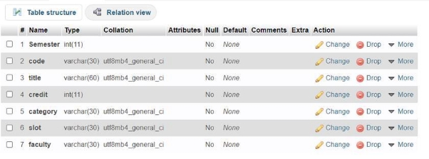
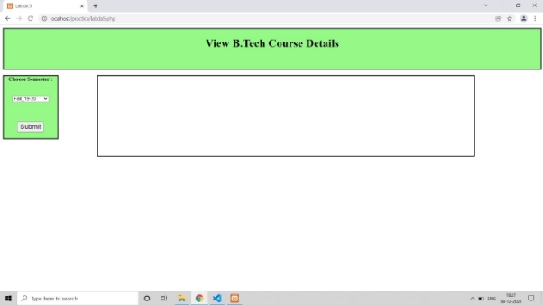
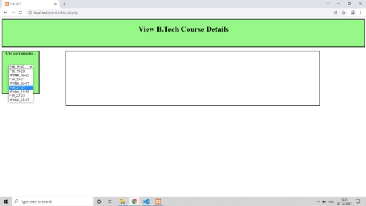
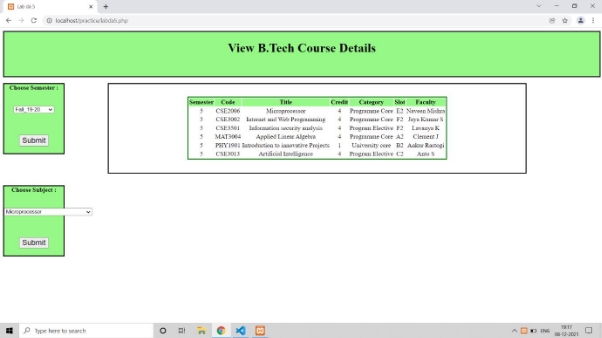
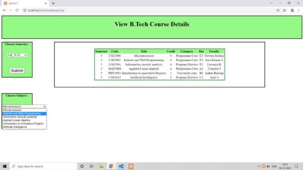

**MARK VIEW **

Github Repository**:[ https://github.com/Jeya-Suriyaa/MarkView ](https://github.com/Jeya-Suriyaa/MarkView)**See more of my projects @[ https://github.com/Jeya-Suriyaa ](https://github.com/Jeya-Suriyaa)

This is a responsive site that helps you view all the marks you have got during the course of university education. I have used html and css. And used php in the backend. MySql is used to connect to the database. 

From the Sidebar feature you can choose the semester from the dropdown list. Here are the detailed steps for implementing the project. 

Design 2 databases one with courses (semester) and other with marks(sem\_marks): Semester table structure: 

Semester table Data format: 

Semester Marks table Structure: 

Semester marks table Data format: 

ScreenShots: 

WebPage Design: 

Drop down list having names of all the semesters: 

After the required semester is chosen a detailed information on all courses that have been taken in this particular semester is displayed as table format. 

After choosing semester , the page allows user to select subject from chosen semester to view marks. 

The marks of the chosen subject is displayed. 

